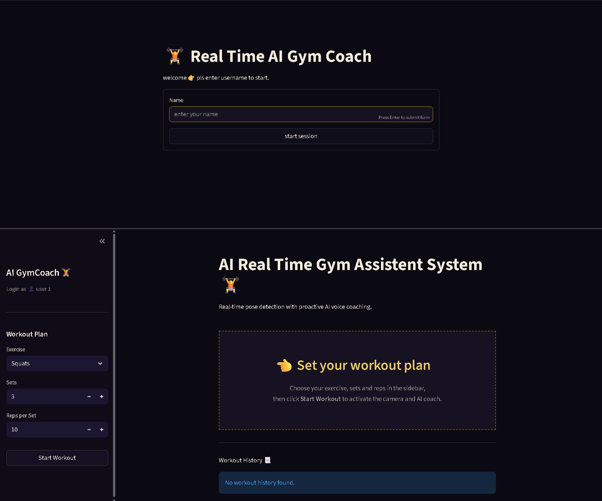

<div align="center">

# ***GymSense 🏋️‍♂️✨***
--- 

### ***🤖 Real-Time AI Gym Coach powered by Computer Vision***
***Real-Time Pose Detection • Exercise Form Analysis • Rep Counting • Set Tracking • AI Voice Coaching***

<p align="center">

</p>

<p align="center">


</p>

--- 

### ***🌟 About GymSense***

***GymSense is a real-time AI fitness coach that uses your webcam to analyze exercise movements and provide instant feedback on workout form.***

***The system combines **MediaPipe Pose Landmarker**, **OpenCV**, **NumPy-based geometry**, exercise-specific rules, and **Streamlit** to create an interactive computer-vision fitness application.***

***GymSense can detect body landmarks, calculate joint angles, identify exercise movement phases, count valid repetitions, track sets, save workout history, and optionally provide AI-generated voice coaching.***

<p align="center">
<a href="https://gymsense-smartai.streamlit.app" target="_blank">

</a>
</p>

</div>

---

### ***Live Demo***

🌐 **Web Application:** [Gymsense AI](https://sparkly-wisp-176a63.netlify.app)

---

### ***📸 Project Preview***

<p align="center">

</p>

---

### ***What GymSense Can Do***

- 🎥 Real-time webcam pose detection
- 🦴 33-point MediaPipe body landmark tracking
- 📐 Joint-angle and alignment analysis
- 🏋️ Exercise-specific form evaluation
- 🔢 Automatic repetition counting
- 📊 Set and workout tracking
- 💬 Real-time visual feedback
- 🔊 Optional AI voice coaching
- 👤 User login and workout history

---

### ***🏋️ Supported Exercises***

| Exercise | Key Analysis |
|---|---|
| 🏋️ Squats | Knee/hip angles, movement phase, depth |
| 💪 Push-ups | Elbow angle, body alignment, movement phase |
| 💪 Biceps Curls | Elbow angle and curl movement |
| 🏋️ Shoulder Press | Arm movement and shoulder/elbow positioning |
| 🦵 Lunges | Knee/hip angles and lower-body alignment |

Each exercise has its own detector and rule set for evaluating movement quality before a repetition is counted.

---

### ***🧠 How GymSense Works***

```text
                    📷 Webcam
                       │
                       ▼
             OpenCV / WebRTC Stream
                       │
                       ▼
            MediaPipe Pose Landmarker
                       │
                       ▼
              33 Body Landmarks
                       │
                       ▼
             Joint Angle Calculation
                       │
                       ▼
          Exercise-Specific Detector
                       │
             ┌─────────┴─────────┐
             ▼                   ▼
       Form Evaluation       Movement Phase
             │                   │
             └─────────┬─────────┘
                       ▼
                Rep Validation
                       │
                       ▼
                  Set Tracking
                       │
             ┌─────────┴─────────┐
             ▼                   ▼
       Visual Feedback      AI Voice Coach
```

---

## ***🔍 Exercise Detection Pipeline***

For every video frame, GymSense follows a computer-vision pipeline:

```text
Frame
  ↓
Pose Detection
  ↓
Landmark Extraction
  ↓
Select Required Body Points
  ↓
Calculate Joint Angles
  ↓
Check Alignment
  ↓
Identify Movement Phase
  ↓
Validate Form
  ↓
Update Rep Counter
  ↓
Update Set / Workout State
  ↓
Display Feedback
```

***The application uses **state-based exercise detectors** rather than simply counting every movement. A repetition is counted only when the required movement phases and form conditions are satisfied.***

---

### ***📐 Pose & Form Analysis***

GymSense uses body landmarks to calculate useful geometric measurements.

For example:

```text
        Shoulder
           ●
          / \
         /   \
        ●     ●
      Elbow   Hip
        |
        |
        ●
       Knee
        |
        |
        ●
       Ankle
```

Joint angles can be calculated using three body landmarks:

```text
A ●
   \
    \
     ● B
      \
       \
        ● C
```

Where:

```text
Angle ABC = angle between BA and BC
```

These angles are then used with exercise-specific thresholds and movement states to determine whether the user is performing the exercise correctly.

---

### ***🧩 Tech Stack***

### ***AI & Computer Vision***

- **MediaPipe Pose Landmarker**
- **OpenCV**
- **NumPy**
- Exercise-specific pose rules
- Joint-angle geometry

### ***Application***

- **Python 3.11**
- **Streamlit**
- **streamlit-webrtc**

### ***AI Coaching***

- **Groq API**
- **gTTS**
- AI-generated coaching feedback

### ***Data & Persistence***

- **SQLite**
- **Pandas**

### ***Deployment***

- **Docker**
- **Render**

### ***Render WebRTC Setup***

The live camera uses `streamlit-webrtc`. Public STUN servers are enough on
some networks, but a TURN server is required when the browser or network uses
restrictive NAT/firewall rules. Without TURN, the camera can stay stuck on
"Connection is taking longer than expected".

In Render, open **Environment** and add either the individual variables below
or one `ICE_SERVERS` variable. Use a TURN provider such as Metered, Twilio
Network Traversal, Cloudflare TURN, or a self-hosted coturn server.

```text
TURN_SERVER_URL=turns:your-turn-provider.example.com:443?transport=tcp
TURN_USERNAME=your-turn-username
TURN_CREDENTIAL=your-turn-credential
```

The JSON option is useful when the provider gives multiple UDP/TCP/TLS
endpoints:

```json
[{"urls":["stun:stun.l.google.com:19302","turns:your-turn-provider.example.com:443?transport=tcp"],"username":"your-turn-username","credential":"your-turn-credential"}]
```

After saving the variables, manually redeploy the service and allow camera
access in the browser. Test in an incognito window and on a mobile hotspot.
If TURN is unavailable, the reliable architectural alternative is to move
MediaPipe into the browser and send only pose metrics to the server; this
removes WebRTC server traversal completely, but requires a frontend rewrite.

---

### ***📁 Project Structure***

```text
GymSense/
│
├── main.py                         # Streamlit application entrypoint
├── requirements.txt                # Python dependencies
├── Dockerfile                      # Docker configuration
├── render.yaml                     # Render Blueprint configuration
├── packages.txt                    # Linux packages for hosted environments
│
├── preview/
│   └── ui.png                      # Project UI screenshot
│
└── src/
    ├── detectors/                  # Exercise-specific pose detectors
    │
    ├── models/                     # MediaPipe pose model
    │
    └── services/
        ├── auth/                   # User authentication
        ├── coaching/               # LLM and voice coaching
        ├── config/                 # Exercise and pose configuration
        ├── persistence/            # SQLite repository
        ├── state/                  # Streamlit session state
        ├── tracking/               # Metrics synchronization
        ├── ui/                     # UI and styling helpers
        └── vision/                 # Webcam and pose processing
```

---

### ***📊 Reported Performance***

The current project evaluation reports:

| Metric | Reported Result |
|---|---:|
| Labeled validation repetitions | 600 |
| Mean accuracy | ~95% |
| Processing latency | ~100 ms/frame |
| CPU performance | ~28 FPS |
| Webcam input | 720p |

These are project evaluation results, not universal guarantees. Performance can vary depending on lighting, camera position, hardware, browser behavior, and user movement.

---

## ***🧪 Validation Approach***

GymSense evaluates repetitions using exercise-specific rules rather than simply detecting motion.

A typical validation flow is:

```text
Movement Detected
       ↓
Correct Starting Position?
       ↓
Required Angle Reached?
       ↓
Correct Movement Phase?
       ↓
Form Conditions Satisfied?
       ↓
       YES
       ↓
Count Valid Rep
       ↓
Update Workout Metrics
```

This helps reduce false repetition counts caused by incomplete or incorrect movements.

---

### ***⚠️ Limitations***

- Camera placement can affect pose accuracy.
- Poor lighting may reduce landmark quality.
- Body occlusion can make landmarks unreliable.
- Exercise thresholds are currently hand-tuned.
- Different body proportions may require different thresholds.
- SQLite uses local disk storage and may not survive restarts on some free cloud hosting environments.
- Groq and gTTS require network access and valid service configuration.
- WebRTC behavior depends on browser permissions and network connectivity.

---

### ***🔮 Future Enhancements***

### ***Computer Vision***

- Add more exercises:
  - Deadlifts
  - Rows
  - Bench Press
  - Planks
  - Jumping Jacks
- Improve pose-quality filtering
- Add adaptive exercise thresholds
- Train a dedicated form-classification model

### ***AI & Personalization***

- Personalized safe movement ranges
- AI workout recommendations
- Personalized coaching plans
- Automatic workout summaries
- Advanced form scoring

### ***Analytics***

- Progress charts
- Weekly/monthly workout analytics
- Rep-quality trends
- Exercise performance history
- Personal fitness dashboard

### ***Platform***

- Cloud database
- Mobile application
- On-device inference
- Better mobile responsiveness
- Multi-user cloud synchronization

---

### ***🎯 Real-World Use Cases***

✔ Home Workout Assistant

✔ AI Fitness Coach

✔ Computer Vision Demonstration

✔ Exercise Form Monitoring

✔ Rep & Set Tracking

✔ Fitness Technology Prototype

✔ AI/ML Portfolio Project

✔ Computer Vision Learning Project

---

## ***💼 Why This Project Is Valuable for an AI Engineer Portfolio***

GymSense demonstrates an end-to-end AI application rather than only a standalone ML model.

```text
Computer Vision
      +
Real-Time Video Processing
      +
Pose Estimation
      +
Geometric Feature Engineering
      +
Rule-Based Decision System
      +
State Management
      +
LLM Integration
      +
Voice Generation
      +
Database Persistence
      +
Docker
      +
Cloud Deployment
```

This makes the project useful for demonstrating practical skills in:

- Computer Vision
- Python
- MediaPipe
- OpenCV
- Real-Time AI
- Streamlit
- API Integration
- SQLite
- Docker
- Cloud Deployment
- AI Application Development

---

## ***🧠 Key Learning Outcomes***

Through GymSense, the project demonstrates how to:

1. Process live webcam frames.
2. Extract human body landmarks.
3. Calculate joint angles using geometry.
4. Build exercise-specific detection logic.
5. Design movement-state machines.
6. Count valid repetitions.
7. Track workout sets.
8. Persist workout records.
9. Integrate an LLM for coaching.
10. Generate voice feedback.
11. Package an AI application with Docker.
12. Deploy a real-time application to the cloud.

---

## ***🛡️ Safety Notice***

GymSense is an educational and demonstration project. Its form feedback should not be treated as medical advice or a substitute for a qualified fitness professional.

Users should exercise within their abilities and stop if they experience pain, dizziness, or other concerning symptoms.

---

## ***👨‍💻 Developer***

<div align="center">

# ***ANKIT GUPTA 👦***

### ***AI Engineer • AI Backend Developer • GenAI & Computer Vision Developer***

**Building practical AI systems with Python, Computer Vision, GenAI and Agentic AI**

</div>

---

### ***⭐ Support the Project***

If you find GymSense useful or interesting:

- ⭐ Star the repository
- 🍴 Fork the project
- 🐛 Report issues
- 💡 Suggest new exercises or features
- 📢 Share the project

Your support helps motivate further development.

---

<div align="center">

### ***GymSense 🏋️‍♂️✨***

***See the Movement. Understand the Form. Improve the Workout.***

### ***Built with ❤️ by Ankit Gupta***

</div>
